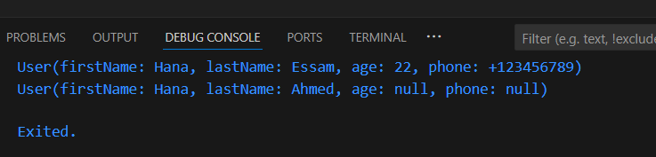

# Builder Design Pattern in Dart

This project demonstrates the implementation of the Builder Design Pattern in Dart. The Builder Design Pattern is used to construct complex objects step by step. It separates the construction of a complex object from its representation, allowing the same construction process to create different representations.

## Project Structure

- `user.dart`: Contains the `User` class and the `UserBuilder` class.
- `main.dart`: Contains the main function to demonstrate the usage of the `UserBuilder` to create `User` instances.

## Classes

### User Class

The `User` class represents a user with the following properties:
- `firstName`: The first name of the user (required).
- `lastName`: The last name of the user (required).
- `age`: The age of the user (optional).
- `phone`: The phone number of the user (optional).

The `User` class has a private constructor and a factory constructor that takes a `UserBuilder` instance to create a `User` instance.

### UserBuilder Class

The `UserBuilder` class is used to build a `User` instance step by step. It provides the following methods:
- `setFirstName(String firstName)`: Sets the first name and returns the builder instance.
- `setLastName(String lastName)`: Sets the last name and returns the builder instance.
- `setAge(int age)`: Sets the age and returns the builder instance.
- `setPhone(String phone)`: Sets the phone number and returns the builder instance.
- `build()`: Builds and returns a `User` instance. Throws an exception if the first name or last name is not set.

## Usage

In the `main.dart` file, the `UserBuilder` is used to create `User` instances.

```dart
import 'user.dart';

void main() {
  // Creating a User instance with all properties set
  User user1 = UserBuilder()
      .setFirstName("Hana")
      .setLastName("Essam")
      .setAge(22)
      .setPhone("+123456789")
      .build();

  print(user1);

  // Creating a User instance with only required properties set
  User user2 = UserBuilder()
      .setFirstName("Hana")
      .setLastName("Ahmed")
      .build(); 

  print(user2);
}

### Output 
